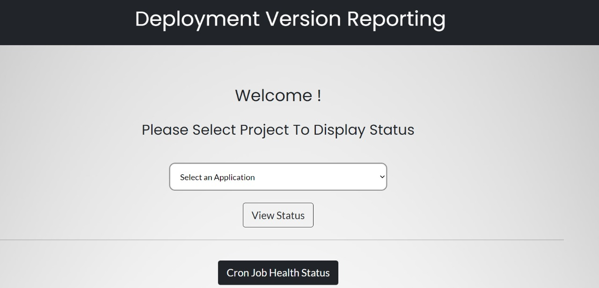
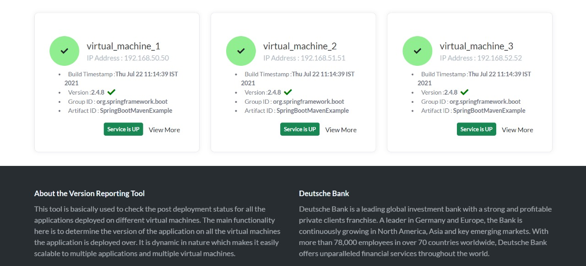
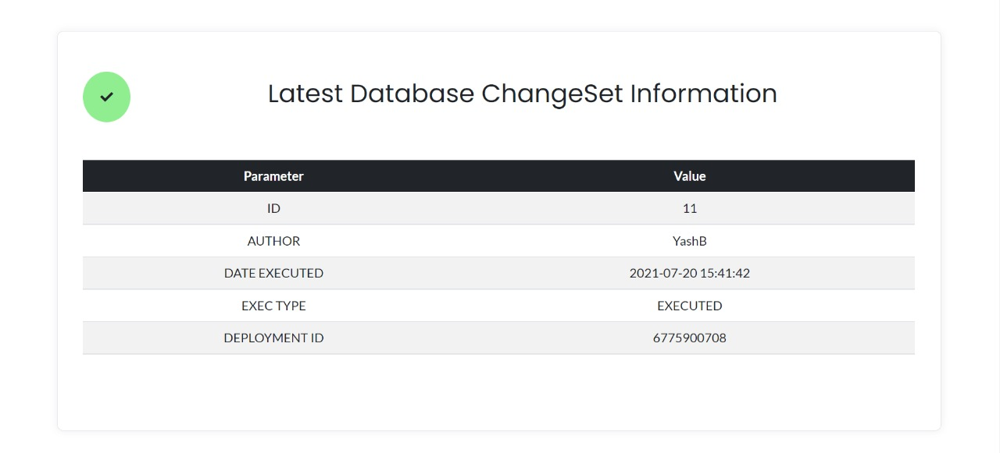

# CI-CD Dashboard Application

> This is a flask based dashboard application for version and information checking of deployments made via jenkins pipelines. It is used as a maintanence tool for CI/CD pipelines specifically for java based applications. 

## Table of Contents
* [Technologies Used](#technologies-used)
* [Features](#features)
* [Screenshots](#screenshots)
* [Usage](#usage)
* [Contributors](#contributors)

## Technologies Used
- HTML, CSS, Bootstrap - for the front end
- Flask - for developing the backend of the dashboard
- Jenkins - for implementing CI/CD pipelines
- Liquibase - for database SCM
- Spring boot admin - for health and sanity check information

## Features
1. Deployment Version Reporting 
2. Application monitoring Information
3. Configuration and Integration with Spring Boot Admin
4. Health Check Information Reporting
5. Integration with Liquibase for applications with Database

 
 

## Screenshots

 

 

 

## Usage
- Start the dashboard by `python app.py`
- Service will run on `Port:5000` of server 

 
 

## Contributors 
 
 

 

